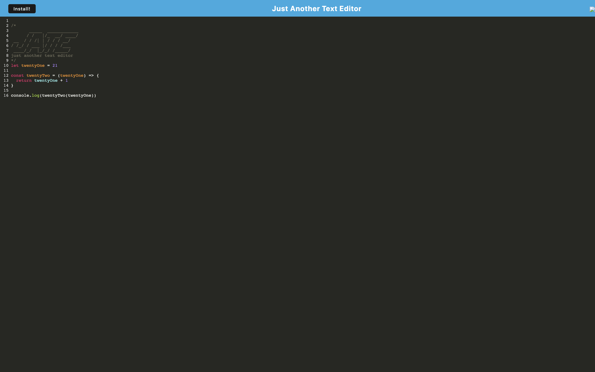

# J.A.T.E

 

To watch a demo of the functionality, [click here](https://pwa-text-editor-uwa-4d3de5b7a94c.herokuapp.com/).


In this project, I developed a Progressive Web App (PWA) text editor. This app enables users to create and save content directly within their web browsers. While the app functions seamlessly online, its true marvel lies in its offline capabilities. Even without an internet connection, users can continue to utilize the app with full functionality. Furthermore, users have the convenience of downloading the app and accessing it as a web app on their devices.

## Description 

The main goal of this project was to design a Progressive Web App (PWA) text editor, providing users with a seamless environment to type and store their content directly within the browser. The app's standout feature is its ability to function offline, allowing users to continue utilizing it even when not connected to the internet. This PWA text editor serves as an excellent platform for users to efficiently compose and save their data effortlessly.

## Table of Contents

* [Title](#title)
* [Description](#description)
* [Installation](#installation)
* [Usage](#usage)
* [Author](#author)
* [GitHub Link and Demo](#github-link-and-demo)
* [License](#license)

## Installation:

```bash
npm install
npm run start
```


## Usage
```
1. run "npm run install "
2. run "npm run start"
3. access the app via the browser and click the download button to download it locally.
```

###

Written by Christian Alteri

To learn more about my project, [click here](https://github.com/ChristianAlteri/PWA-Text-Editor).


####

[](LICENSE)
